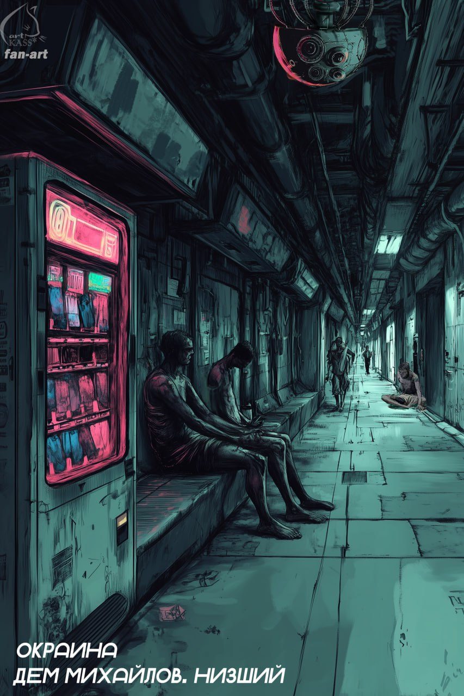
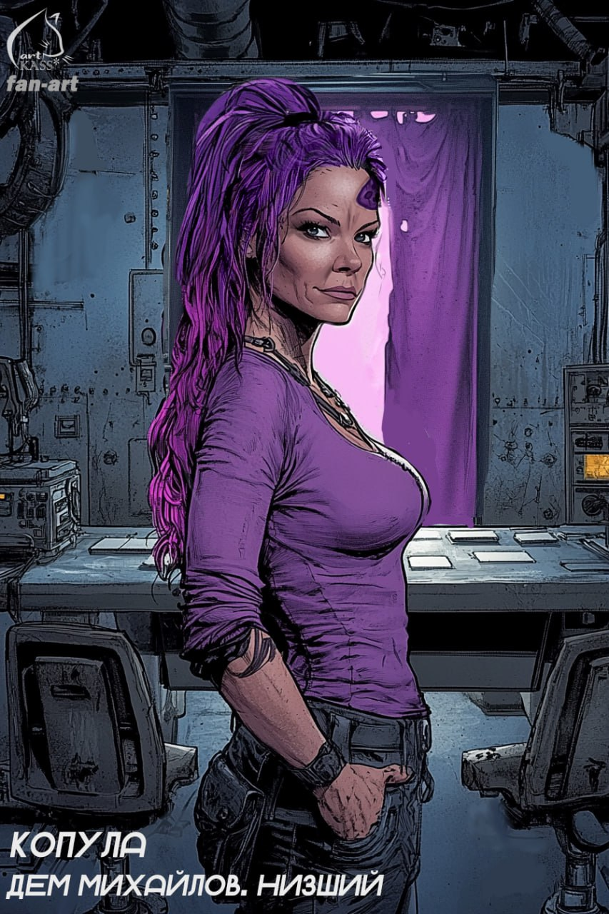

**Визуальная новелла (демоверсия) на движке Ра по книжному миру Низший.**   
**Рабочее название: Хромой гоблин.** 

Задача проекта: продемонстрировать игрокам и игроделам возможность движка Ра как в отдельной независимой сборке, так и в браузерной версии. Возможность наработать портфолио художнику. 

**Общие положения \- необходимый минимум, после достижения коего проект будет считаться успешно завершенным:**

1. Новелла с максимально урезанными возможностями \- демоверсия.   
2. Количество локаций \- 10-12 (соответственно столько же артов)  
3. Количество персонажей массовки \- 6-8 (соответственно столько же артов)  
4. Количество знаковых персонажей \- 4-5 (соответственно столько же артов)  
5. Количество предметов \- 8-12 (соответственно столько же артов)  
6. Возможность выбора главного героя и пол \- нет.   
7. Заявленный игровой процесс \- выбор из предложенных вариантов и следование по одной из ветвей.   
8. Количество главных сюжетных ветвей \- 2\. (незавершенных, только начало)  
9. Побочные сюжетные квесты \- нет.   
10. Ежедневный квест (рабочее задание) \- 1\. (серая слизь) (заработок солов)  
11. Дополнительное рабочее задание \- 1 (повторно вызваться на серую слизь)  
12. Процедура укола и кормежки в медблоке.   
13. Игровые ивенты \- события (негативные и положительные)  
14. Окно инвентаря \- с лежащими в нем предметами. Окно небольшое \- пять на пять клеток максимум. 

**Состав команды:**

1. Дем \- сюжет.   
2. Ра \- программирование.   
3. касс\* \- художник. (если согласится) \- если нет, то придется решать с помощью нейросетей самостоятельно. 

**Примерный срок создания по заявленному минимуму** \- 2-3 месяца. (если максимально никуда не торопиться)

**Перечень локаций** (соответственно столько же артов на каждую)**:** 

1. Тупик рождения \- 1 локация.   
2. Магистральный коридор с выходами в более узкие коридоры \- 2 локации.   
3. Медблок (внутри и снаружи) \- 2 локации.   
4. Медблок внутри \- лежа на стальном ложе и с видом вверх \- 1 локация.   
5. Узкие коридоры \- 3-4 локации.   
6. Тупик с отдельными капсулами для сна \- 1 локация.   
7. Рабочая зона “серая слизь” \- одна локация.   
8. Спальная “бесплатная” зона с общим теплым ложем для зомби \- 1 локация.  
9. Локация со светящимся экраном (игровой вызов” \- 1 локация.   
10. Локация с торгматами \- без возможности купить что либо. 

**События (ивенты)(часть из них случается не с игроком):**  
1\. Получение игрового вызова \- с рандомным результатом, сам процесс не показан.   
2\. Ночной приход плуксов \- если спишь на общем бесплатном ложе.   
3\. Ночное ограбление \- если спишь на общем бесплатном ложе.   
4\. Ночное похищение кого-то из гоблинов \- если спишь на общем ложе.   
5\. Сцена “наезда” крутых орков на зарвавшегося гоблина \- если спишь в отдельной капсуле.   
6\. Находка пищевого кубика на полу \- взять или не взять решает игрок. Рандомный результат \- либо кубик твой, либо это подстава и тебя “берут за жабры”, тогда придется платить солами. 

**Внешний вид локация \- арты касс\*.** 

**Внешний вид персонажей \- арты касс\***

**Первые шаги:**  
Составить общую карту доступных локаций \- Дем  
Иметь рабочий движок \- Ра  
По карте утвержденных локаций начать создавать арты \- касс\*

**Игровой процесс \- для демо версии.** 

1. Возможность перемещения между локациями \- с помощью активных зон на артах.  
2. Возможность взаимодействия с локациями \- активные зоны. Например сбор предметов.   
3. Возможность размещения на локациях персонажей \- арты.   
4. Возможность принятия квестов и ежедневных заданий \- и отдельное всплывающее окно для их просмотра.   
5. Возможность сохранения и загрузки игры.   
6. Окно инвентаря с возможностью сбора в него предметов и просмотра их.   
7. Деньги \- все что с ними связано. То есть отображение их в интерфейсе игры, траты, заработок и так далее.   
8. Возможность вести диалоги с персонажами.   
9. 
