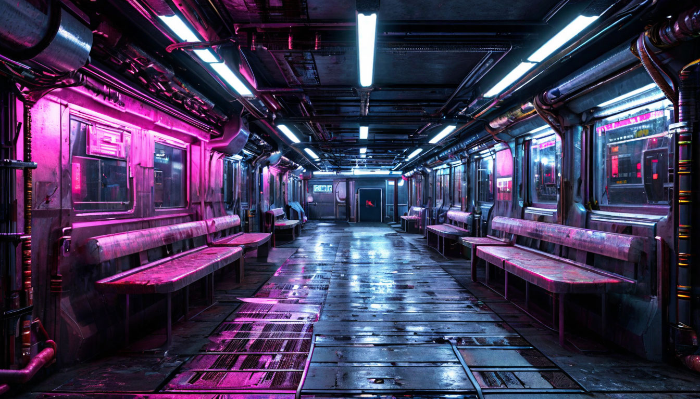
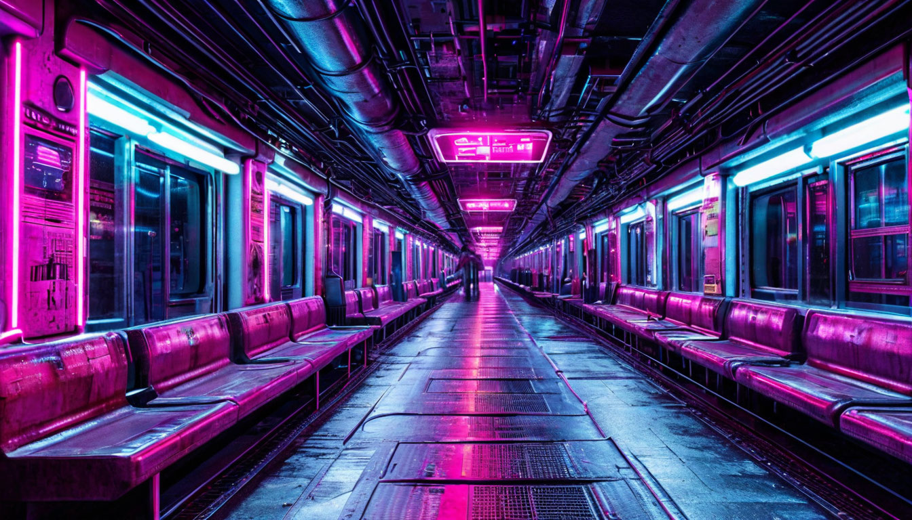
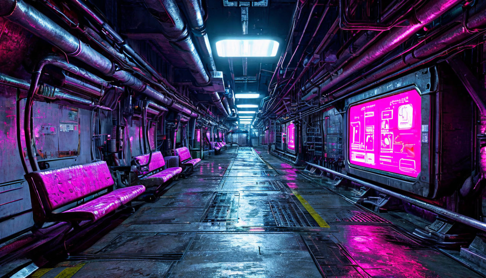
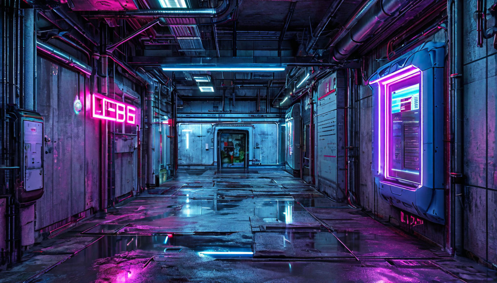
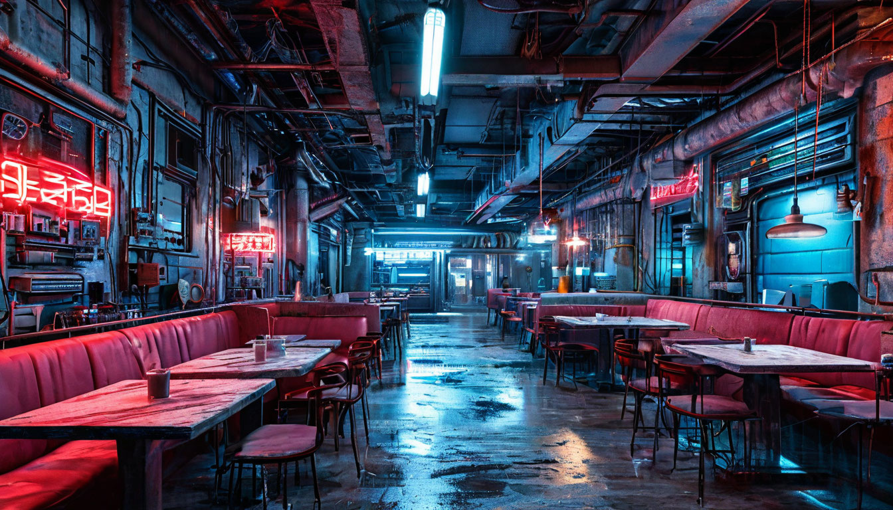
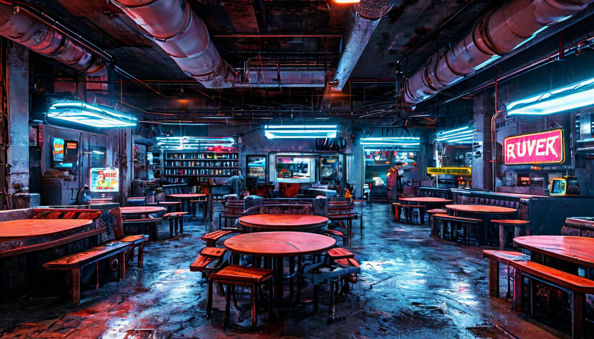

# генерации локаций Окраины

## альбомы
- [альбом со всеми генерациями](alboms.md)

## запросы для [шедеврума](https://shedevrum.ai/text-to-image/)

---
Антиутопический постапокалиптический подземный коридор, разделенный на секции, как на кораблях, освещенный холодными неоновыми огнями, в одной секции в стену встроен информационный терминал, светящийся розовым и голубым, в некоторых секциях из стен выступают скамейки-сиденья, по типу сидений в вагонах метро, стены покрыты трубами и промышленными текстурами, клаустрофобная и темная атмосфера, высокодетализированная эстетика киберпанка, фактурный, атмосферный стиль, контрастные тени и освещение

---

Антиутопический постапокалиптический подземный коридор, разделенный на секции, как на кораблях, освещенный холодными неоновыми огнями, в одной секции в стену встроен информационный терминал, светящийся розовым и голубым, в некоторых секциях из стен выступают сиденья, похожие на сидения в новых вагонах метро, стены покрыты трубами и промышленными текстурами, клаустрофобная и темная атмосфера, высокодетализированная эстетика киберпанка, фактурный, атмосферный стиль, контрастные тени и освещение

---

Антиутопический постапокалиптический подземный коридор, разделенный на секции, как на кораблях, освещенный холодными неоновыми огнями, в одной секции в стену встроен информационный терминал, светящийся розовым и голубым, в некоторых секциях у стен слева выступают сиденья, стены покрыты трубами и промышленными текстурами, клаустрофобная и темная атмосфера, высокодетализированная эстетика киберпанка, фактурный, атмосферный стиль, контрастные тени и освещение

---

жилая зона "клякса" на "окраине" из антиутопического постапокалиптического произведения "Низший" Дема Михайлова, освещенная холодными неоновыми огнями, в одну из стен встроен информационный терминал, светящийся розовым и голубым, стены покрыты промышленными текстурами, клаустрофобная и темная атмосфера, высокодетализированная эстетика киберпанка, фактурный, атмосферный стиль, контрастные тени и освещение

---

жилая зона "клякса" на "окраине" из антиутопического постапокалиптического произведения "Низший" Дема Михайлова, освещенная холодными неоновыми огнями, в ней группами стоят унифицированные столы и сидения для приема пищи и отдыха,  стены покрыты промышленными текстурами, клаустрофобная и темная атмосфера, высокодетализированная эстетика киберпанка, фактурный, атмосферный стиль, контрастные тени и освещение

---

жилая зона "клякса" на "окраине" из антиутопического постапокалиптического произведения "Низший" Дема Михайлова, освещенная холодными неоновыми огнями, в ней группами стоят унифицированные столы и сидения для приема пищи и отдыха, клаустрофобная и темная атмосфера, высокодетализированная эстетика киберпанка, фактурный, атмосферный стиль, контрастные тени и освещение

---