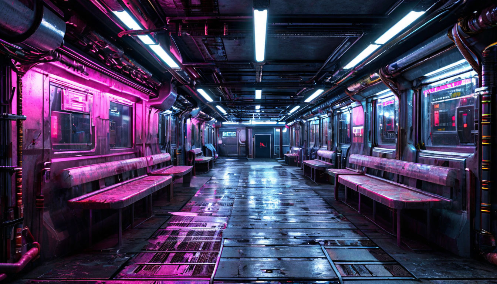
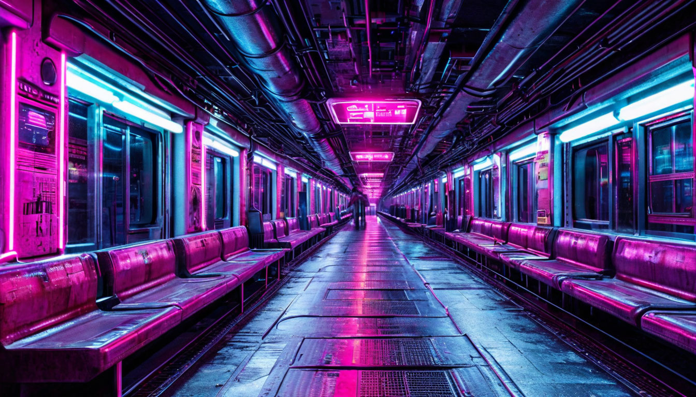
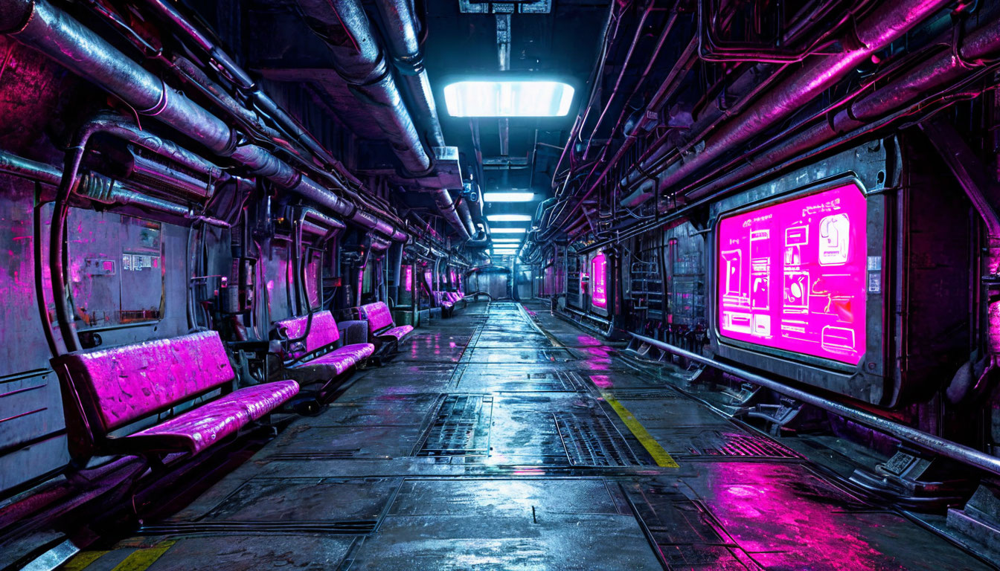

## запросы для [шедеврума](https://shedevrum.ai/text-to-image/)

---
Антиутопический постапокалиптический подземный коридор, разделенный на секции, как на кораблях, освещенный холодными неоновыми огнями, в одной секции в стену встроен информационный терминал, светящийся розовым и голубым, в некоторых секциях из стен выступают скамейки-сиденья, по типу сидений в вагонах метро, стены покрыты трубами и промышленными текстурами, клаустрофобная и темная атмосфера, высокодетализированная эстетика киберпанка, фактурный, атмосферный стиль, контрастные тени и освещение

---

Антиутопический постапокалиптический подземный коридор, разделенный на секции, как на кораблях, освещенный холодными неоновыми огнями, в одной секции в стену встроен информационный терминал, светящийся розовым и голубым, в некоторых секциях из стен выступают сиденья, похожие на сидения в новых вагонах метро, стены покрыты трубами и промышленными текстурами, клаустрофобная и темная атмосфера, высокодетализированная эстетика киберпанка, фактурный, атмосферный стиль, контрастные тени и освещение

---

Антиутопический постапокалиптический подземный коридор, разделенный на секции, как на кораблях, освещенный холодными неоновыми огнями, в одной секции в стену встроен информационный терминал, светящийся розовым и голубым, в некоторых секциях у стен слева выступают сиденья, стены покрыты трубами и промышленными текстурами, клаустрофобная и темная атмосфера, высокодетализированная эстетика киберпанка, фактурный, атмосферный стиль, контрастные тени и освещение

---